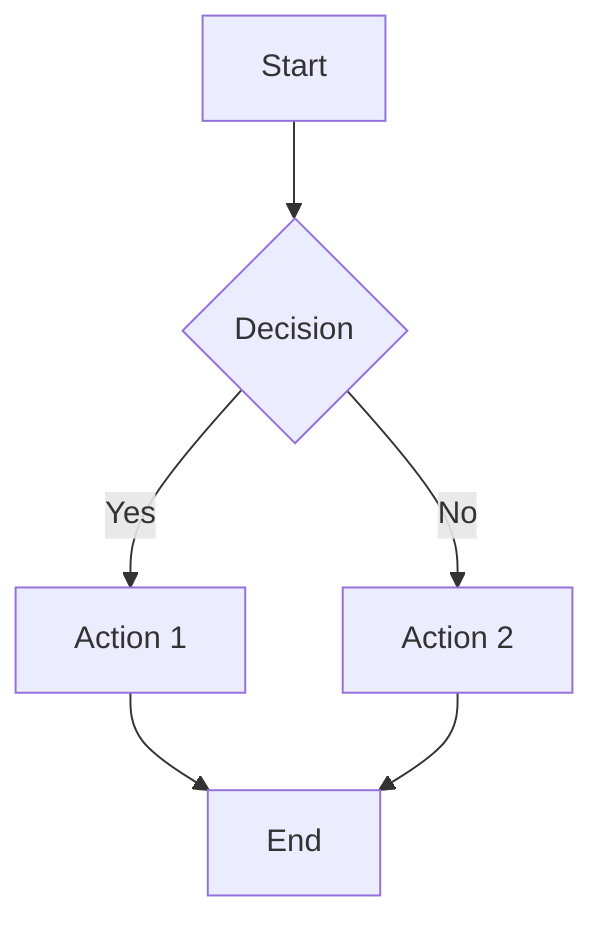
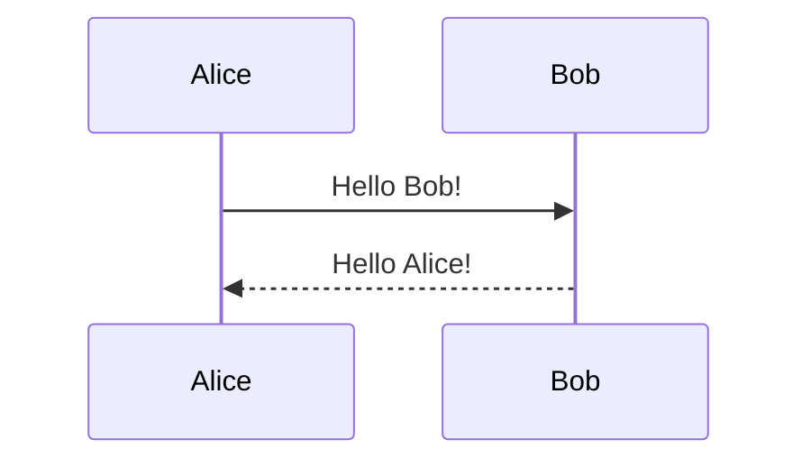
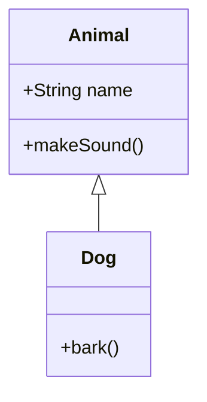

# Mermaid Diagrams in Hugo

This Hugo site now supports Mermaid diagrams! Here's how to use them:

## Configuration

Mermaid is enabled globally in `config.toml`:

```toml
[Languages.en-us.params]
  mermaid = true
```

You can also enable Mermaid on a per-page basis by adding to the front matter:

```yaml
---
title: "Your Post Title"
mermaid: true
---
```

## Usage Methods

### Method 1: Code Fences (Recommended)

Use standard markdown code fences with `mermaid` as the language:

````markdown

````

### Method 2: Shortcode

Use the custom shortcode for more complex scenarios:

```markdown

sequenceDiagram
participant Alice
participant Bob
Alice->>Bob: Hello Bob, how are you?
Bob-->>Alice: Great!

```

## Supported Diagram Types

Mermaid supports many diagram types:

- **Flowchart**: `flowchart` or `graph`
- **Sequence Diagram**: `sequenceDiagram`
- **Class Diagram**: `classDiagram`
- **State Diagram**: `stateDiagram-v2`
- **Entity Relationship Diagram**: `erDiagram`
- **User Journey**: `journey`
- **Gantt**: `gantt`
- **Pie Chart**: `pie`
- **Git Graph**: `gitgraph`

## Theme Integration

The Mermaid implementation automatically adapts to your Hugo theme:

- **Dark Mode**: Diagrams use dark theme when your site is in dark mode
- **Light Mode**: Diagrams use default theme for light mode
- **Auto Mode**: Automatically switches based on user's system preference

## Examples

### Flowchart



### Sequence Diagram



### Class Diagram



## Troubleshooting

1. **Diagrams not rendering**: Ensure `mermaid: true` is set in your post's front matter or globally in config.toml
2. **Theme issues**: The diagrams should automatically adapt to your site theme
3. **Syntax errors**: Use the [Mermaid Live Editor](https://mermaid.live/) to test your diagram syntax

## Files Modified/Created

- `layouts/partials/head.html` - Added Mermaid script inclusion
- `layouts/partials/helpers/mermaid.html` - Mermaid initialization script
- `layouts/shortcodes/mermaid.html` - Shortcode for Mermaid diagrams
- `assets/css/mermaid.css` - Styling for Mermaid diagrams
- `config.toml` - Added `mermaid = true` parameter

The setup uses Mermaid v10 from CDN for the latest features and best performance.
