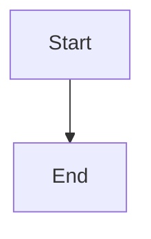

## Simple Diagram Test

This should render as a diagram:

```mermaid
graph TD
    A[Start] --> B[End]
```

## Using Shortcode


graph LR
X[Input] --> Y[Output]


Both should render as actual diagrams, not code blocks.
