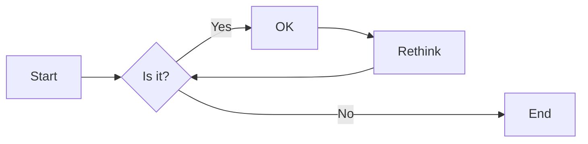
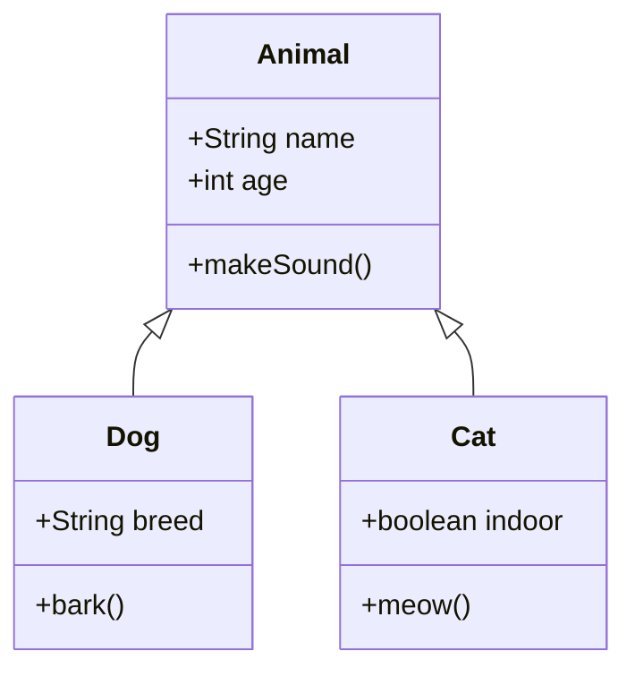

This post demonstrates how to use Mermaid diagrams in your Hugo site. There are two ways to include Mermaid diagrams:

## Method 1: Using Code Fences

You can use standard markdown code fences with the `mermaid` language identifier:

## Method 2: Using the Mermaid Shortcode

You can also use the custom shortcode:


sequenceDiagram
participant Alice
participant Bob
Alice->>John: Hello John, how are you?
loop Healthcheck
John->>John: Fight against hypochondria
end
Note right of John: Rational thoughts prevail!
John-->>Alice: Great!
John->>Bob: How about you?
Bob-->>John: Jolly good!


## More Complex Example

Here's a more complex flowchart:

## Class Diagram Example

All diagrams should render properly and adapt to your site's theme automatically.
