+++
title = 'NVMe, Modern I/O and scalable KV stores'
description = 'Exploring the architecture of next-gen key-value stores using NVMe, io_uring, and ScyllaDB'
keywords = ['NVMe', 'io_uring', 'ScyllaDB', 'LMDB']
date = 2025-08-18T20:14:47-07:00
draft = false
mermaid = true
+++

# NVMe, Modern I/O, and Scalable Databases: Building the Next-Generation KV Stores

## TL;DR

The landscape of high-performance storage has shifted fundamentally. NVMe SSDs deliver microsecond latency
and multi-GB/s throughput per device, shifting bottlenecks from disk mechanics to CPU, PCIe fabrics,
and software stacks. For modern KV stores, this means **rethinking metadata vs. data storage separation**,
**embracing async APIs (`io_uring`)**, and **leveraging kernel-bypass frameworks (DPDK/SPDK)**.

With the right architecture, we can scale from a single workstation-class box to cloud-scale,
NVMe-oF powered disaggregated storage.

---

## Why LMDB for metadata?

For KV systems, LMDB (Lightning Memory-Mapped Database) shines as a **lightweight, ACID-compliant metadata store**. By using LMDB primarily for **metadata (keys, object references, namespace catalogs)** and **not for storing user data itself**, we sidestep the `mmap` pitfalls identified in CIDR’22.

- LMDB works as a reliable catalog and reference index.
- Data payloads are stored elsewhere (e.g., object files, log-structured segments, or Scylla tables).
- This avoids buffer pool replacement complexity since metadata is small and access patterns are more index-like.

In this hybrid design, LMDB is the “brain,” Scylla (or another large-scale DB) is the “backbone,” and
raw NVMe-backed data segments hold the actual payloads.

---

## Why Scylla for scalable data?

ScyllaDB, a **C++ rewrite of Apache Cassandra**, is optimized for **shard-per-core execution** and takes
advantage of **NUMA locality**. With NVMe drives:

- Each shard can map directly to a queue on the NVMe device.
- Writes and reads are parallelized without global locks.
- Latency stays predictable at high throughput thanks to Scylla’s event-driven scheduling model.

For massive datasets, Scylla provides distribution, replication, and failover that complement LMDB’s role as a fast, local metadata manager.

---

## Modern I/O advantages: io_uring, DPDK, SPDK

### 1. io_uring

- Shared submission/completion queues drastically cut syscall overhead.
- Registered buffers and files eliminate repeated setup costs.
- `SQPOLL` (submission queue polling) and `IOPOLL` enable ultra-low-latency paths.
- Ideal for **KV store engines**, where thousands of small random I/O operations must stay efficient.

### 2. DPDK (Data Plane Development Kit)

- Removes kernel overhead from the **networking path**.
- Paired with NVMe-oF (TCP/RDMA), DPDK ensures **network throughput matches storage throughput**.
- Critical when scaling beyond a single host to disaggregated NVMe pools.

### 3. SPDK (Storage Performance Development Kit)

- Moves NVMe I/O to user space with polled-mode drivers.
- Ideal for scenarios where **every microsecond matters** (e.g., hot data, transactional KV workloads).
- Enables building user-space storage services that can act as high-performance block or object backends for Scylla or custom engines.

---

## Practical design for a KV + Scylla system

1. **Metadata path**

   - LMDB handles namespaces, file/record references, small metadata records.
   - Transactions stay light, low-latency, and resilient.

2. **Data path**

   - Large values and user objects go directly into ScyllaDB tables (sharded across cores and nodes).
   - Scylla handles replication, compaction, and scaling.

3. **I/O path**

   - Use `io_uring` for kernel-managed async I/O.
   - For critical hot-path latency, use SPDK (NVMe polled drivers).
   - For remote/disaggregated deployments, layer **NVMe-oF over DPDK**.

4. **Scaling out**
   - On a single box: NVMe drives + io_uring saturate local IOPS and bandwidth.
   - Across racks: NVMe-oF with DPDK ensures distributed nodes don’t bottleneck on networking.
   - The software stack remains consistent: LMDB for metadata, Scylla for large-scale data, SPDK/DPDK for ultra-low-latency data planes.

---

## Conclusion

By combining:

- **LMDB for metadata**,
- **Scylla for distributed scalability**, and
- **NVMe + io_uring/DPDK/SPDK for I/O efficiency**,

we align system architecture with the realities of modern storage hardware. NVMe SSDs remove traditional disk bottlenecks; now, system scalability depends on eliminating kernel overheads, aligning data structures to hardware queues, and using databases suited for multi-core and NUMA scaling. This blueprint ensures the KV store layer remains both **highly performant and operationally scalable**.

---

## References

- [arXiv: Reading from External Memory (Savchenko, 2021)](https://arxiv.org/pdf/2102.11198) — Survey of HDD, SATA, NVMe, and Optane performance; benchmarks of Linux I/O APIs.
- [Tanel Poder: 11M IOPS with 10 SSDs on Threadripper Pro](https://tanelpoder.com/posts/11m-iops-with-10-ssds-on-amd-threadripper-pro-workstation/) — Real-world workstation benchmark showing limits are CPU/PCIe, not disks.
- [CIDR 2022: Are You Sure You Want to Use mmap in Your DBMS?](https://db.cs.cmu.edu/mmap-cidr2022/) — Paper showing why mmap fails for DBMS buffer pools; recommends explicit buffer management.
- [Jens Axboe: Efficient IO with io_uring](https://kernel.dk/io_uring.pdf) — Detailed description of Linux `io_uring`, design, and performance advantages.

---

## Architecture Diagram (Mermaid)

```mermaid
%%{init: {'theme':'base', 'themeVariables': {'fontSize':'24px', 'fontFamily':'Roboto, Arial, sans-serif', 'primaryColor':'#ffffff', 'primaryTextColor':'#000000', 'primaryBorderColor':'#333333', 'lineColor':'#333333'}, 'flowchart': {'nodeSpacing': 80, 'rankSpacing': 100}}}%%
flowchart LR
  %% Top-level: Client apps use a KV service
  A["🖥️ Client Apps<br/>REST/gRPC APIs"] --> B["⚡ KV Service / API<br/>Request Router"]

  %% Metadata path
  B --> M[("💾 LMDB<br/>Metadata Catalog<br/>Keys & References")]

  %% Value routing: small vs. large
  B -->|"🔍 value lookup"| R{"📊 Value Type?<br/>Size Check"}
  R -->|"📝 small/metadata-only"| M
  R -->|"🗂️ large value"| SD["🔌 Scylla Client/Driver<br/>Distributed Access"]

  %% Local I/O paths on the KV host
  subgraph LIO["🏠 Local NVMe I/O on KV Host"]
    direction TB
    UR["⚙️ io_uring<br/>Kernel Async I/O<br/>High Performance"] --> NV[("💽 Local NVMe SSDs<br/>Ultra-Low Latency<br/>Multi-GB/s")]
    SP["🚀 SPDK NVMe<br/>User-Space Polled<br/>Microsecond Access"] --> NV
  end

  %% Scylla cluster path for large values
  SD --> SC[["🌐 Scylla Cluster<br/>Shard-per-Core<br/>Distributed Storage"]]

  %% Optional disaggregation over SPDK LAN (NVMe-oF)
  subgraph NET["🌍 SPDK LAN / NVMe-oF Fabric"]
    direction TB
    INI["📡 DPDK + NVMe-oF<br/>Initiator<br/>Network Acceleration"] --- TGT["🎯 SPDK NVMe-oF<br/>Target<br/>Remote Access"]
  end

  %% Remote NVMe target
  TGT --> RNV[("🌐 Remote NVMe SSDs<br/>Disaggregated Storage<br/>Scale-Out Capacity")]

  %% Wiring optional remote path
  B -.->|"🔥 optional hot path"| INI
  INI -.->|"🔗 block access"| RNV

  %% Enhanced styling with bigger fonts and larger nodes
  classDef comp fill:#2196f3,stroke:#1565c0,stroke-width:4px,color:#ffffff,font-size:20px,font-weight:bold;
  classDef store fill:#4caf50,stroke:#2e7d32,stroke-width:4px,color:#ffffff,font-size:20px,font-weight:bold;
  classDef fabric fill:#ff9800,stroke:#ef6c00,stroke-width:4px,color:#ffffff,font-size:20px,font-weight:bold;
  classDef decision fill:#9c27b0,stroke:#6a1b9a,stroke-width:4px,color:#ffffff,font-size:20px,font-weight:bold;

  class A,B,M,SD,UR,SP,INI,TGT,SC comp;
  class NV,RNV store;
  class NET,LIO fabric;
  class R decision;
```

**Legend**

- **LMDB** holds _metadata only_ (namespaces, object refs, indexes).
- **Scylla** stores _large values_ and handles sharding/replication.
- **io_uring** = default async I/O path to local NVMe.
- **SPDK** = user-space polled drivers for ultra-low-latency NVMe; also powers **NVMe-oF** targets on the **SPDK LAN**.
- **DPDK** accelerates the network dataplane for NVMe-oF initiators/targets.
